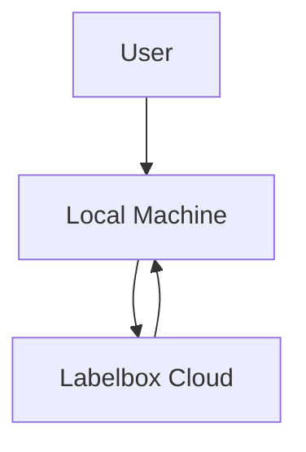

# Design Items: Database Layouts, Network Topologies, and Other Designs

## Database Layout
- **Not applicable.** No external database is used. All data is stored in the organized directory structure under `project_data/`.

## Network Topology
- **Simple client-cloud architecture:**
  - Local machine runs all scripts and workflows.
  - Connects to Labelbox cloud via API for annotation management and data transfer.
  - No other networked components.

## Directory/Data Organization
- All data, models, configs, and logs are organized under `project_data/` by workflow, as described in the README and final design document.

## Diagrams

## Other Design Items
- **Tracking Configs:** Custom YAML files for ByteTrack and BoT-SORT are stored in `project_data/configs/trackers/`.
- **Workflow Manifests:** Each workflow run includes a manifest JSON for reproducibility. 