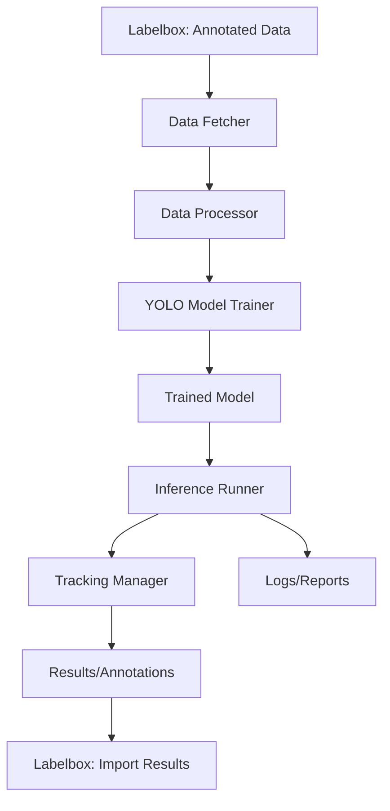

# Final Design Document: Project Sightline

## Overview
Project Sightline is a modular pipeline for training and running object detection and tracking models on Valorant gameplay. It integrates Labelbox for annotation management and YOLO for model training/inference, supporting both static and dynamic gameplay elements. The system is designed for reproducibility, extensibility, and ease of use.

## Architecture
- **Annotation Management:** Uses Labelbox for data labeling, import/export, and project management.
- **Data Pipeline:** Fetches, processes, and organizes video and annotation data for training and inference.
- **Model Training:** Utilizes YOLO (Ultralytics) for object detection, with custom configuration for Valorant.
- **Inference & Tracking:** Supports multiple tracking methods (Sightline, ByteTrack, BoT-SORT) for robust player/object tracking.
- **Workflow Management:** Each workflow run is organized in a timestamped directory, with all inputs, outputs, and logs stored for reproducibility.

## High-Level Workflow

## Major Design Choices
- **Directory Structure:** All data, models, configs, and logs are organized by workflow for traceability.
- **Environment Configuration:** Uses `.env` for all secrets and tunable parameters, with a template provided.
- **Extensible Tracking:** Tracking method is selectable per run, supporting both custom and official trackers.
- **Reproducibility:** All scripts and configs are versioned; each run is self-contained.
- **Interactive & Batch Modes:** The workflow supports both interactive prompts and command-line arguments for automation, and is run via `python -m core.run_workflow`.

## Rationale
- **Labelbox Integration:** Chosen for its robust annotation tools and API.
- **YOLO:** Selected for its speed, accuracy, and ease of transfer learning.
- **Custom Tracking:** Valorant-specific requirements necessitated custom and tuned tracking configs.
- **Workflow Organization:** Ensures that experiments are reproducible and results are easy to audit.

## See also
- [docs/notes.md](./notes.md) for project notes and unexpected findings
- [docs/goals_and_status.md](./goals_and_status.md) for project goals and their outcomes
- [docs/components.md](./components.md) for detailed component documentation 